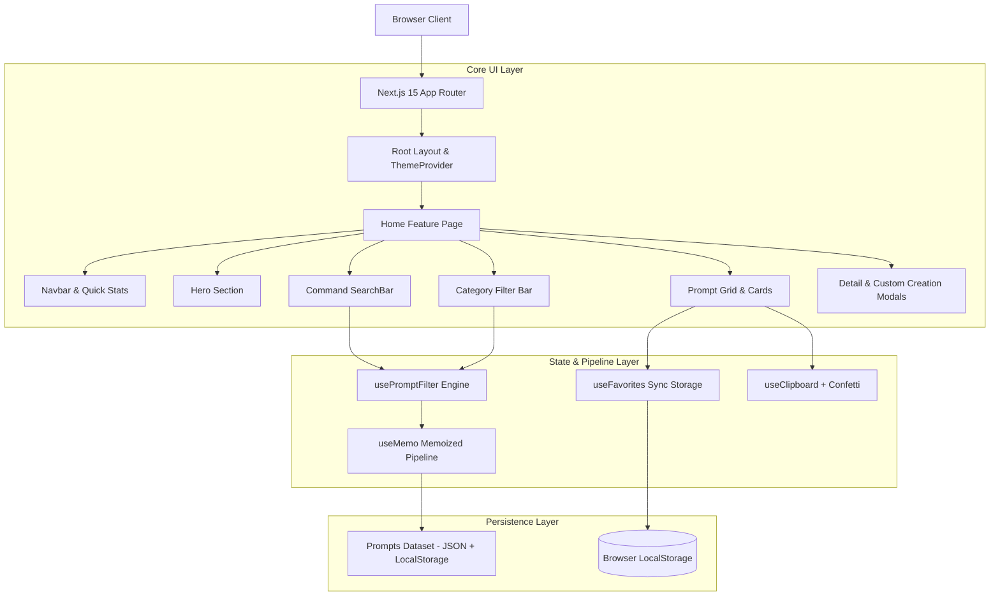
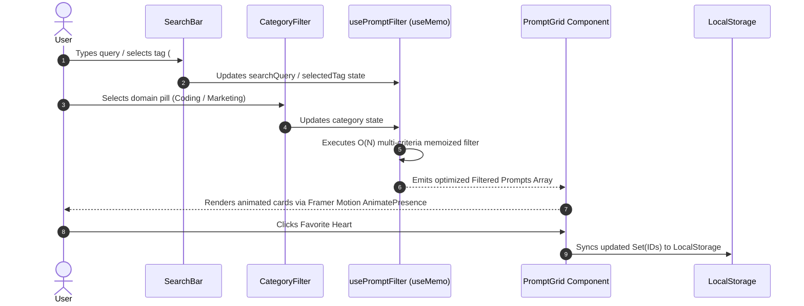

# ⚡ AI Prompt Vault — System Architecture & Documentation

> **A high-performance, modular Prompt Engineering Management Application engineered with Next.js 15 (App Router), TypeScript, Tailwind CSS, Framer Motion, and Client-Side State Optimizations.**

---

## 📐 Executive Overview

**AI Prompt Vault** is an enterprise-grade prompt management system designed to streamline the storage, discovery, parameterization, and deployment of production AI system prompts across Large Language Models (ChatGPT, Claude 3.5, DeepSeek R1).

While lightweight for initial deployment, its codebase is engineered according to **Modular Software Architecture Principles**—demarcating UI primitives, domain taxonomy, state hooks, and client-side storage abstractions to ensure seamless scalability into a full-stack SaaS platform.

---

## 🏛️ High-Level System Architecture



---

## 🔄 Data & State Flow Architecture



---

## 🧰 Tech Stack Matrix & Architectural Rationale

| Layer | Technology | Selection Rationale |
| :--- | :--- | :--- |
| **Framework** | **Next.js 15 (App Router)** | Leverages React Server Component boundaries, route segment optimization, and zero-bundle server layouts. |
| **Language** | **TypeScript 5.x** | Enforces strict end-to-end type safety (`Prompt`, `CategoryType`, `FilterState`), preventing runtime null reference errors. |
| **Styling** | **Tailwind CSS v4** | Provides utility-first, responsive atomic CSS with dark mode class strategy (`.dark`) and zero runtime style overhead. |
| **Animation** | **Framer Motion** | Powers fluid active-tab layout transitions (`layoutId`), staggered card mounting, and modal backdrop animations. |
| **Icons** | **Lucide React** | Lightweight, tree-shakeable SVG icon set matching modern design systems. |
| **Theme System** | **next-themes** | Client theme provider preventing Flash of Unstyled Text (FOUT) with `localStorage` persistence. |
| **State Management** | **React Custom Hooks** | Eliminates external state library overhead (Redux/Zustand) for MVP while maintaining decoupled reactivity via `useState` and `useMemo`. |

---

## 📁 Repository Directory Taxonomy

```
ai-prompt-vault/
├── app/
│   ├── layout.tsx         # Root layout configuring NextFont (Inter/JetBrains Mono) & ThemeProvider
│   ├── page.tsx           # Page orchestrator assembling Hero, Search, Filters, Grid & Modals
│   └── globals.css        # Tailwind v4 directives, custom scrollbars, and dark mode tokens
│
├── components/
│   ├── navbar/
│   │   └── Navbar.tsx     # Brand header with total prompt counters & theme toggle trigger
│   ├── search/
│   │   └── SearchBar.tsx  # Cmd+K command search bar, clear button, tag pills & sort dropdown
│   ├── filters/
│   │   └── CategoryFilter.tsx # Domain category pills with prompt counts & Favorites toggle
│   ├── prompt/
│   │   ├── PromptCard.tsx         # Interactive card with placeholder regex highlighting
│   │   ├── PromptGrid.tsx         # Responsive 1/2/4 grid with AnimatePresence transitions
│   │   ├── CopyButton.tsx         # One-click copy trigger with success feedback
│   │   ├── FavoriteButton.tsx     # Animated bookmark heart toggle
│   │   ├── PromptDetailModal.tsx  # Modal with live variable input parameterizer
│   │   └── CreatePromptModal.tsx  # Form dialog for creating user custom prompts
│   ├── common/
│   │   ├── Hero.tsx               # Glassmorphic Hero section with live statistics pills
│   │   ├── EmptyState.tsx         # Zero-search-results fallback state
│   │   ├── ThemeToggle.tsx        # Dark/Light theme toggle using useSyncExternalStore
│   │   └── Footer.tsx             # Footer layout with open-source credits
│   └── ui/                        # Reusable UI Primitives
│       ├── button.tsx             # Variant-based Button primitive (glow, ghost, outline)
│       ├── badge.tsx              # Category and complexity badge pills
│       └── input.tsx              # Standardized form input primitives
│
├── data/
│   └── prompts.json       # Production JSON dataset containing 25+ curated system prompts
│
├── hooks/
│   ├── useClipboard.ts    # Browser Clipboard API wrapper with timed reset & particle confetti
│   ├── useFavorites.ts    # Synchronized LocalStorage state manager for favorited prompt IDs
│   └── usePromptFilter.ts # Memoized multi-field filtering engine
│
├── constants/
│   └── categories.ts      # Domain taxonomy, color gradients, icons, and metadata mappings
│
├── lib/
│   └── utils.ts           # Class merging (`clsx` + `tailwind-merge`) & placeholder regex extractor
│
├── providers/
│   └── ThemeProvider.tsx  # NextThemes Client Provider wrapper
│
└── types/
    └── prompt.ts          # Strictly typed domain interfaces and filter states
```

---

## ⚡ Core Engineering Highlights

### 1. Dynamic Variable Parameterization Engine
Prompts in the repository contain parameter placeholders structured as `[Parameter Name]`. 
The `PromptDetailModal` parses the template using regex (`/\[(.*?)\]/g`), dynamically generating input fields for each placeholder. Users can fill values in real time to generate fully populated system instructions.

```typescript
// Regex Extractor Utility (lib/utils.ts)
export function extractPlaceholders(promptText: string): string[] {
  const regex = /\[(.*?)\]/g;
  const matches = promptText.match(regex);
  if (!matches) return [];
  return Array.from(new Set(matches.map((m) => m.slice(1, -1))));
}
```

### 2. Memoized Multi-Criteria Filtering Engine
The search algorithm filters across `title`, `description`, `category`, `tags`, and `prompt` body text simultaneously. The output array is wrapped in a `useMemo` hook to ensure zero unnecessary re-renders during high-frequency keystrokes.

### 3. Hydration-Safe Dark Mode Switching
To eliminate React 19 SSR hydration mismatch warnings, the `ThemeToggle` component utilizes `React.useSyncExternalStore` for client-side mounting detection prior to DOM manipulation.

---

## 🚀 Getting Started & Local Setup

### Prerequisites
- **Node.js**: `v18.17.0` or higher
- **npm**: `v9.x` or higher

### Installation

1. **Clone the Repository**:
   ```bash
   git clone https://github.com/your-username/ai-prompt-vault.git
   cd ai-prompt-vault
   ```

2. **Install Dependencies**:
   ```bash
   npm install
   ```

3. **Launch Local Development Server**:
   ```bash
   npm run dev
   ```
   Open your browser at `http://localhost:3000`.

---

## 🧪 Quality & Verification Suite

The repository includes strict static analysis scripts:

```bash
# Execute TypeScript Compiler checks without output generation
npx tsc --noEmit

# Run ESLint for code formatting and React best practices
npm run lint

# Build production bundle
npm run build
```

---

## 🗺️ Enterprise Roadmap (V2 & V3 Vision)

```mermaid
graph LR
    subgraph V1 MVP (Current)
        LocalJSON[Local JSON Dataset]
        LocalStorage[Browser Storage]
        HooksState[React Hooks]
    end

    subgraph V2 SaaS Expansion
        Auth[Clerk / NextAuth]
        Database[(PostgreSQL + Prisma)]
        API[Next.js API Routes]
    end

    subgraph V3 AI Intelligence
        VectorDB[(Pinecone Vector Search)]
        Embeddings[Semantic Prompt Search]
        AI Eval[LLM Auto-Prompt Refiner]
    end

    V1 MVP --> V2 SaaS Expansion
    V2 SaaS Expansion --> V3 AI Intelligence
```

- **Phase 2 (Backend Integration)**: Migrate from `localStorage` to **PostgreSQL + Prisma ORM**, implement **OAuth User Authentication** (Clerk), and add custom prompt collection sharing.
- **Phase 3 (AI Enhancement)**: Integrate **pgvector / Pinecone** for semantic prompt similarity search, markdown rendering, and automated prompt evaluation via OpenAI / Anthropic API routes.

---

## 📄 License
Released under the **MIT License**. Created for developers and AI engineers building scalable generative AI applications.
